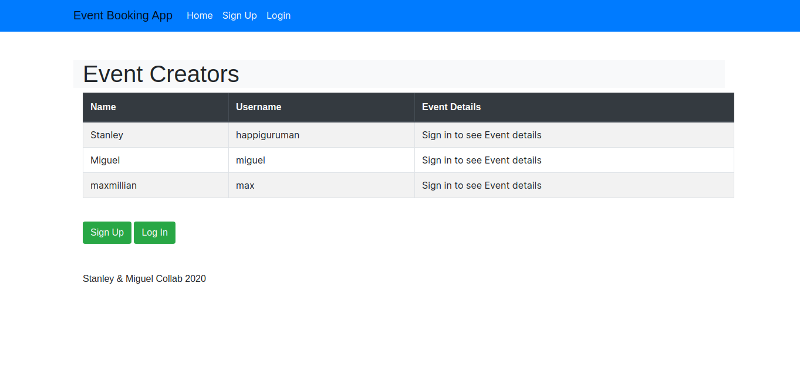
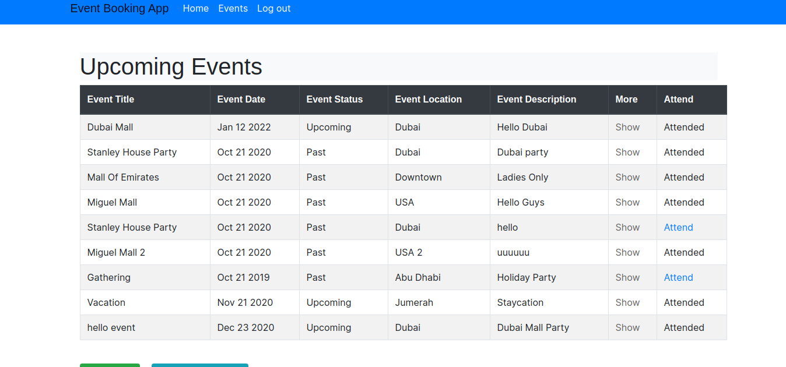
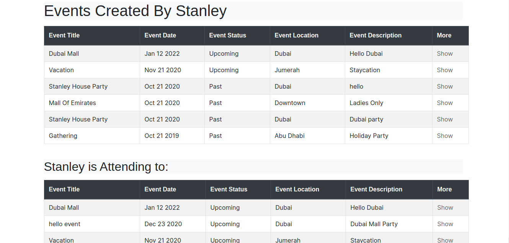

# Private-Event Booking Application
Private Event Application built with Ruby on Rails

In this project we built an exclusive Private Event Booking App where users invite other users for an event.

> This README documents the steps involved to implement a Private Event project which is based on Association, Authentication.

This project was built with:

- Ruby. v2.7.0
- Ruby on Rails v6.0.3.3
- Rubocop Linters
- Bootstrap

## 🛠 Getting Started
## Install 
In order to run, you need to install Ruby in your computer. For windows you can go to [Ruby installer](https://rubyinstaller.org/) and for MAC and LINUX you can go to [Ruby official site](https://www.ruby-lang.org/en/downloads/) for intructions on how to intall it.

## Run the application
To get a local copy up and running follow these simple steps.

- Open a terminal
- Clone this repo using: `git clone "https://github.com/happiguru/private-event"`
- Run this command to install the necessary gems: `bundle install`
- Run the migrations with this code: `rails db:migrate`
- Run a localserver using: `rails server`

## Open app in browser

- When the program is running go to your browser
- put: localhost:3000/
- Click on login, register and Sign up as a new member
- Enjoy the app

## ✒️ Authors

👤 **Stanley Enow Lekunze**

- Github: [@happiguru](https://github.com/happiguru)
- LinkedIn:[LinkedIn](https://www.linkedin.com/in/lekunze-nley)

👤 **Miguel Uzcátegui**

- Github: [@Miguelus373](https://github.com/Miguelus373)
- LinkedIn:[LinkedIn](https://www.linkedin.com/in/)

## 🤝 Contributing
Contributions, issues and feature requests are welcome!

Feel free to check the [issues page](https://github.com/happiguru/private-event/issues).

## 📝 License
This project is [MIT](lic.url) licensed.